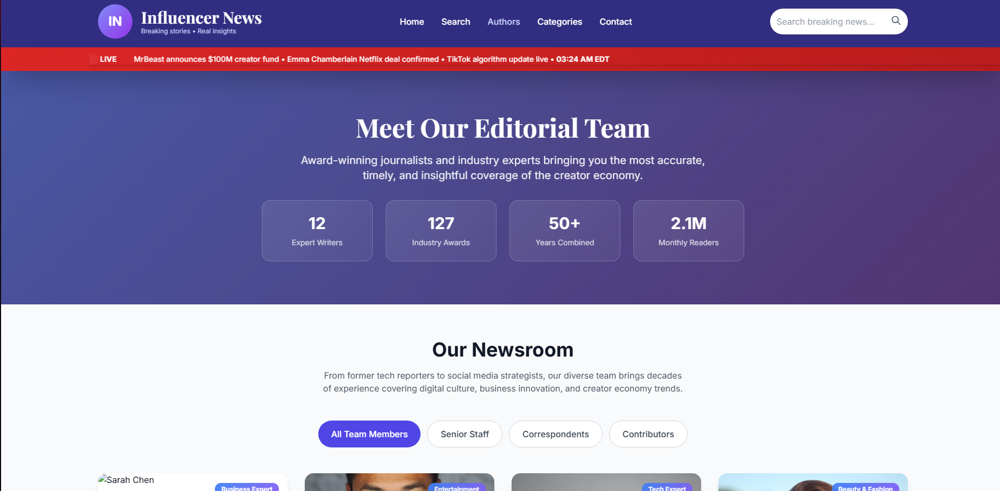

# 📰 Influencer News - Content Management System

A comprehensive desktop application for managing a static news website focused on the influencer and creator economy. Features GUI-based content integration, organized file structure, and automated HTML generation with professional styling.

[](https://www.python.org/downloads/)
[](https://opensource.org/licenses/MIT)
[]()

## ✨ Features

### 🖥️ **Desktop GUI Application**
- Visual dashboard with real-time status indicators
- Progress tracking with detailed logging
- Selective content integration
- Content management and removal tools

### 📝 **Multi-Content Support**
- **Articles** - News stories with rich formatting
- **Authors** - Professional profile pages with bios and social links
- **Categories** - Organized content categorization with color theming
- **Trending Topics** - Real-time trend analysis with platform metrics

### 🌐 **Professional Website Generation**
- Responsive design with Tailwind CSS
- Automatic cross-linking between content types
- SEO-optimized pages with meta tags
- Mobile-friendly layouts

### 🔄 **Smart Integration System**
- Database tracking prevents duplicate processing
- Organized folder structure (`content/` → `integrated/`)
- Automatic HTML generation and navigation updates
- Sync utility for database-website alignment

## 🚀 Quick Start

### Prerequisites
- Python 3.7 or higher
- No additional dependencies (uses built-in tkinter)

### Installation

1. **Clone the repository**
   ```bash
   git clone https://github.com/yourusername/InfNews.git
   cd InfNews
   ```

2. **Launch the application**
   ```bash
   python3 integration_manager.py
   ```

3. **Create your first content**
   - Click "Setup" buttons to create sample files
   - Edit samples or create new `.txt` files in `content/` directories
   - Use "Integrate" to process your content

4. **View your website**
   - Open `index.html` in your browser
   - Navigate through articles, authors, and categories

## 📖 Documentation

- **[Quick Start Guide](QUICK_START_GUIDE.md)** - Get running in 5 minutes
- **[Content Format Guide](CONTENT_FORMAT_GUIDE.md)** - Complete formatting reference
- **[Integration Guide](INTEGRATION_GUIDE.md)** - Advanced usage and features

## 🎯 Content Types

### Articles
```
Title: Breaking: New Creator Fund Announced
Author: Sarah Chen
Category: business
Image: https://images.unsplash.com/photo-123...
Tags: creator fund, monetization, youtube
Excerpt: Major platform announces $100M creator fund...

---

Your article content in markdown format...
```

### Authors
```
Name: Sarah Chen
Title: Senior Business Reporter
Bio: Expert in creator economy and digital business
Image: https://images.unsplash.com/photo-456...
Location: Los Angeles, CA
Expertise: Business, Creator Economy, Market Analysis
```

### Categories
```
Name: Creator Economy
Slug: creator-economy
Icon: 💰
Color: green
Description: Business of content creation and monetization
```

### Trending Topics
```
Topic: AI Content Creation Revolution
Hashtag: #AIContent
Category: tech
Trend_Score: 8500
Status: active
Youtube_Mentions: 45000
TikTok_Mentions: 38000
```

## 🏗️ Project Structure

```
InfNews/
├── content/                    # Source content files (.txt)
│   ├── articles/              # Article source files
│   ├── authors/               # Author profile files
│   ├── categories/            # Category definition files
│   └── trending/              # Trending topic files
├── integrated/                # Generated HTML content
│   ├── articles/              # Individual article pages
│   ├── authors/               # Author profile pages
│   ├── categories/            # Category pages + listing
│   └── trending/              # Trending pages + listing
├── data/                      # JSON databases
├── src/integrators/           # Core integration logic
├── integration_manager.py     # Main GUI application
├── sync_site.py              # Site synchronization utility
└── *.html                    # Main website pages
```

## 🖼️ Screenshots

### Integration Manager Dashboard


### Generated Article Page


### Categories Overview


### Authors Listing


## 🛠️ Advanced Usage

### Command Line Tools
```bash
# Sync website with database state
python3 sync_site.py

# Check content status
python3 sync_site.py status
```

### Selective Integration
- Use the "Selective Integration" tab in the GUI
- Choose specific files to process
- Ideal for large content batches

### Content Management
- Browse all integrated content
- Remove content by ID or filename
- Clean orphaned files
- Bulk content operations

## 🔧 Development

### Adding New Content Types
1. Create integrator class extending `BaseIntegrator`
2. Implement required abstract methods
3. Add to integration manager GUI
4. Update documentation

### Customization
- **Colors**: Modify category color schemes in integrators
- **Templates**: Edit HTML generation methods
- **Styling**: Update Tailwind CSS classes
- **Layout**: Customize page structures

## 🤝 Contributing

1. **Fork the repository**
2. **Create a feature branch** (`git checkout -b feature/amazing-feature`)
3. **Commit your changes** (`git commit -m 'Add amazing feature'`)
4. **Push to branch** (`git push origin feature/amazing-feature`)
5. **Open a Pull Request**

Please read [CONTRIBUTING.md](CONTRIBUTING.md) for details on our code of conduct and development process.

## 📄 License

This project is licensed under the MIT License - see the [LICENSE](LICENSE) file for details.

## 🙏 Acknowledgments

- **Tailwind CSS** for responsive styling
- **Unsplash** for high-quality placeholder images
- **Python tkinter** for cross-platform GUI support
- **Creator economy community** for inspiration and feedback

## 📊 Stats

- **4 Content Types** supported
- **Professional HTML** generation
- **Cross-platform** compatibility
- **Zero external dependencies**
- **Database-driven** content management

## 📞 Support

- **Issues**: [GitHub Issues](https://github.com/yourusername/InfNews/issues)
- **Discussions**: [GitHub Discussions](https://github.com/yourusername/InfNews/discussions)
- **Documentation**: Available in the `docs/` directory

---

**Built with ❤️ for the creator economy community**

[🌟 Star this project](https://github.com/yourusername/InfNews) if you find it useful!